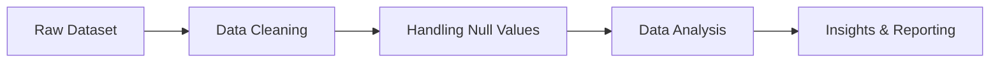

# Titanic

---

## 🚀 Project Overview  
This project explores the **Titanic dataset** using SQL Server, focusing on transforming raw data into meaningful insights.

✨ It demonstrates:
- Real-world **data cleaning techniques**
- Handling **missing & inconsistent data**
- Extracting **business-driven insights**

---

## 🎯 Objectives  

✔️ Clean raw dataset  
✔️ Handle null values & duplicates  
✔️ Perform exploratory data analysis (EDA)  
✔️ Generate actionable insights using SQL  

---

## 🗃️ Dataset Features  

| Column        | Description |
|--------------|------------|
| PassengerId  | Unique ID |
| Name         | Passenger Name |
| Sex          | Gender |
| Age          | Age |
| Pclass       | Ticket Class |
| Fare         | Ticket Price |
| Cabin        | Cabin Number |
| Embarked     | Boarding Port |
| Survived     | Survival Status |

---

## ⚙️ Workflow  



---

## 🧹 Data Cleaning  

🔍 Checked missing values in all columns  
🧾 Detected duplicate records  
✂️ Removed extra spaces using TRIM()  

### 🔧 Null Handling Strategy  
- Age → Replaced with **Average Age**  
- Cabin → 'Not Defined'  
- Embarked → 'Not Defined'  

---

## 📊 Exploratory Data Analysis  

### 👥 Passenger Insights  
- Total passengers  
- Survival distribution  
- Gender-based survival  

### 🧑‍🤝‍🧑 Demographics  
- Age group survival trends  
- Class-wise distribution  
- Gender vs Class analysis  

### 👨‍👩‍👧 Family Analysis  
- SibSp (siblings/spouses)  
- Parch (parents/children)  

### 💰 Fare Analysis  
- Average, Min, Max fare  
- Total revenue  
- Fare by gender  

### 🌍 Location Insights  
- Embarkation distribution  

---

## 📈 Key Insights  

✨ Females had significantly higher survival rates  
✨ 1st class passengers survived more  
✨ Children (≤10 age) had better survival chances  
✨ Higher fare = higher survival probability  

---

## 🛠️ SQL Skills Demonstrated  

```sql
✔ GROUP BY & HAVING
✔ CASE WHEN
✔ Aggregate Functions
✔ Data Cleaning Functions
✔ Subqueries
✔ Transactions
```

---

## 💻 How to Run  

```bash
1. Clone the repository
2. Open SQL Server (SSMS)
3. Run the SQL script
4. Analyze results
```

---

## 🔮 Future Enhancements  

🚀 Power BI Dashboard  
🚀 Stored Procedures  
🚀 Views for reporting  
🚀 Machine Learning Model  

---

## 👨‍💻 Author  

**Anshu Das**  
📊 Data Analyst | SQL Enthusiast  

---

## ⭐ Show Your Support  

If you like this project:  
👉 Star ⭐ this repository  
👉 Share it on LinkedIn  
👉 Follow for more projects  

---

<p align="center">🔥 "Turning Data into Decisions" 🔥</p>
